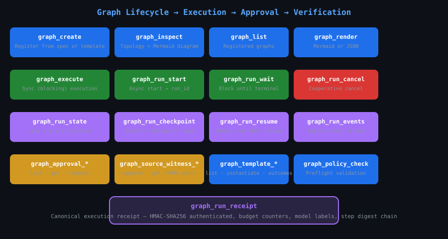

# agent-graph-mcp

**MCP server for graph-orchestrated LLM workflows** — 25 typed tools, daemon/proxy architecture, checkpoint/resume, human-in-the-loop approvals, and HMAC-authenticated execution receipts.

[](https://crates.io/crates/agent-graph-mcp)
[](https://docs.rs/agent-graph-mcp)
[](LICENSE-MIT)


## What it gives you

- **25 typed MCP tools** — graph lifecycle, execution (sync + async), state inspection, checkpoint/resume, HITL approvals, source witnesses, templates, policy validation
- **Daemon + proxy architecture** — single-process daemon with file lock ownership, crash recovery, and startup mode enforcement; stateless proxy that bridges stdin/stdout to Unix socket
- **Durable persistence** — SQLite-backed with atomic checkpoint transactions, no partial rows after crash
- **Deterministic local checkpoint/resume** — HMAC-SHA256 authenticated checkpoints for linear chains of deterministic `passthrough` and `state_transform` nodes
- **Built-in templates** — `council_deliberation` (3-analyst parallel), `parallel_council` (debate), `plan_critique_refine`, `analysis_pipeline`, `classifier_router`
- **Evidence witnessing** — caller-supplied source capture with HMAC-authenticated receipts; locators never fetched, authority never asserted
- **Crash recovery** — interrupted runs report `interrupted` after restart; no fake `running` or `completed` state



## Architecture

```
Hermes ──→ agent-graph-mcp (proxy) ──Unix socket──→ agent-graph-mcpd (daemon) ──→ SQLite
              stdin/stdout                framed             Tokio async I/O
```

| Component | Description |
|-----------|-------------|
| **Daemon** (`agent-graph-mcpd`) | Single-process owner with file lock, Tokio async Unix socket listener, SQLite persistence, startup mode enforcement, crash recovery |
| **Proxy** (`agent-graph-mcp`) | Stateless stdin/stdout ↔ framed socket bridge; `--direct` flag for legacy in-process mode |
| **Socket** | 0600 permissions, 4-byte BE length prefix + JSON-RPC 2.0 framing |

## Quick start

### 1. Build and install

```bash
cargo build --release -p agent-graph-mcp
cp target/release/agent-graph-mcp ~/.cargo/bin/
cp target/release/agent-graph-mcpd ~/.cargo/bin/
```

### 2. Start the daemon

```bash
mkdir -p ~/.local/share/agent-graph
openssl rand -hex 32 > ~/.local/share/agent-graph/integrity.key
agent-graph-mcpd --data-dir ~/.local/share/agent-graph --socket /tmp/agent-graph.sock &
```

### 3. Configure Hermes

```yaml
mcp_servers:
  agent_graph:
    command: ~/.cargo/bin/agent-graph-mcp
    args:
      - --base-url
      - http://127.0.0.1:11434
      - --model
      - glm-5.2:cloud
      - --data-dir
      - ~/.agent-graph
    enabled: true
```

### 4. Verify

```bash
# Smoke test — verify no tracing pollution on stdout
printf '{"jsonrpc":"2.0","id":1,"method":"initialize","params":{"protocolVersion":"2024-11-05","capabilities":{},"clientInfo":{"name":"test","version":"1"}}}\n{"jsonrpc":"2.0","method":"notifications/initialized","params":{}}\n{"jsonrpc":"2.0","id":2,"method":"tools/list","params":{}}\n' | timeout 5 agent-graph-mcp --base-url http://127.0.0.1:11434 --model glm-5.2:cloud 2>/dev/null | grep -c '"jsonrpc"'
# Expected: 2 (initialize + tools/list response)
```

## Tools reference

### Graph lifecycle (4 tools)

| Tool | Description |
|------|-------------|
| `graph_create` | Create/validate/delete a graph from JSON spec or template |
| `graph_list` | List all registered graphs with metadata |
| `graph_inspect` | Full topology: nodes, edges, Mermaid diagram, hash, reducers |
| `graph_render` | Render as Mermaid diagram or JSON |

### Execution (5 tools)

| Tool | Description |
|------|-------------|
| `graph_execute` | Normal execution is synchronous. Sync (blocking) or async execution |
| `graph_run_start` | Async start → returns `run_id` immediately |
| `graph_run_wait` | Block until terminal state with timeout |
| `graph_run_cancel` | Cooperative cancellation (best-effort) |
| `graph_run_get` | Current status, budget, pending approvals |

### State & checkpointing (4 tools)

| Tool | Description |
|------|-------------|
| `graph_run_state` | Live in-memory state projection |
| `graph_run_events` | Replay event stream from cursor |
| `graph_run_checkpoint` | Durable checkpoint read with integrity verification |
| `graph_run_resume` | Atomic one-shot resume from deterministic-local checkpoint |

### Approval & evidence (5 tools)

| Tool | Description |
|------|-------------|
| `graph_approval_list` | List pending/expired/resolved approvals |
| `graph_approval_get` | Read specific approval metadata |
| `graph_approval_request` | Create checkpoint-bound HITL approval |
| `graph_source_witness_capture` | Persist caller-supplied source content (HMAC-authenticated) |
| `graph_source_witness_get` | Read witness with authentication tag verification |

### Templates & policy (4 tools)

| Tool | Description |
|------|-------------|
| `graph_template_list` | 5 built-in templates |
| `graph_template_instantiate` | Template → graph spec |
| `graph_template_candidates` | Promotion candidates |
| `graph_template_outcomes` | Recorded outcome history |
| `graph_policy_check` | Preflight validation against model/tool/data/budget policy |

### Status & receipts (3 tools)

| Tool | Description |
|------|-------------|
| `graph_status` | Query server/graph/run/events/receipt/templates |
| `graph_run_receipt` | Canonical execution receipt (HMAC-SHA256 authenticated) |

## Graph spec format (v2)

```json
{
  "spec_version": "2",
  "name": "my-workflow",
  "entry": "first_node",
  "max_iterations": 32,
  "max_parallelism": 4,
  "nodes": [
    {"id": "first_node", "type": "llm", "prompt": "Process: {input}", "config": {"output_key": "result"}},
    {"id": "router", "type": "router", "config": {
      "rules": [{"path": "result", "op": "contains", "value": "deep", "targets": ["deep_research"]}],
      "default": ["summarize"]
    }},
    {"id": "deep_research", "type": "llm", "prompt": "Deep dive: {input}"},
    {"id": "summarize", "type": "llm", "prompt": "Summarize: {input}"}
  ],
  "edges": [
    {"from": "first_node", "to": "router"},
    {"from": "deep_research", "to": "END"},
    {"from": "summarize", "to": "END"}
  ],
  "reducers": {"results": "append"}
}
```

## Node types

| Type | Status | Description |
|------|--------|-------------|
| `llm` | ✅ | LLM call via Ollama. Supports `prompt`, `model`, `json_mode`, `output_key`, `input_key`, `timeout_ms` |
| `router` | ✅ | Conditional branching via rules (`path`+`op`+`value`→`targets`) |
| `passthrough` | ✅ | No-op state pass. Useful for fan-out distribution points |
| `state_transform` | ✅ | 10 ops: `set`, `copy`, `delete`, `increment`, `append`, `merge`, `merge_object`, `select`, `compare`, `format` |
| `join` | ✅ | Fan-in merge. 5 modes: `collect_array`, `merge_objects`, `first_non_null`, `all_success`, `quorum` |
| `parallel` | ✅ | Fan-out dispatch. Compiler creates passthrough; engine's `JoinSet` handles real parallelism |
| `subgraph` | ✅ | Reference another registered graph by name |
| `human_approval` | ✅ | Writes approval request to state; emits `InterruptError` for checkpoint-bound resume |

## Council pattern example

For a 3-analyst council, use the `council_deliberation` template or build manually:

```json
{
  "name": "my-council",
  "entry": "coordinator",
  "max_parallelism": 3,
  "nodes": [
    {"id": "coordinator", "type": "llm", "prompt": "Break into 3 workstreams: {input}", "json_mode": true, "config": {"output_key": "workstreams"}},
    {"id": "fanout", "type": "passthrough"},
    {"id": "analyst_0", "type": "llm", "prompt": "Research A: {input}", "config": {"output_key": "r0"}},
    {"id": "analyst_1", "type": "llm", "prompt": "Research B: {input}", "config": {"output_key": "r1"}},
    {"id": "analyst_2", "type": "llm", "prompt": "Research C: {input}", "config": {"output_key": "r2"}},
    {"id": "join", "type": "join", "config": {"inputs": ["r0","r1","r2"], "output": "findings", "mode": "collect_array"}},
    {"id": "synthesize", "type": "llm", "prompt": "Synthesize: {input}", "config": {"input_key": "findings", "output_key": "report"}}
  ],
  "edges": [
    {"from": "coordinator", "to": "fanout"},
    {"from": "fanout", "to": "analyst_0"}, {"from": "fanout", "to": "analyst_1"}, {"from": "fanout", "to": "analyst_2"},
    {"from": "analyst_0", "to": "join"}, {"from": "analyst_1", "to": "join"}, {"from": "analyst_2", "to": "join"},
    {"from": "join", "to": "synthesize"}, {"from": "synthesize", "to": "END"}
  ]
}
```

## Daemon controls

```bash
agent-graph-mcpd --data-dir PATH --socket PATH
```

**Environment variables:**

| Variable | Description |
|----------|-------------|
| `AGENT_GRAPH_INTEGRITY_KEY_PATH` | Path to 32+ byte integrity key file |

**Safety guarantees:**

- Startup mode (keyed vs keyless) is durable across restarts; flipping modes is rejected
- Concurrent daemon instances on the same data directory are rejected via file lock
- Legacy schema variants (missing `executions` table or `owner_instance_id` column) are safely handled
- Socket permissions are 0600 (owner-only)
- Integrity-sensitive operations fail closed with `INTEGRITY_KEY_REQUIRED` when no key is configured

## Capability boundary

- **Runs** are process-local and reported as `volatile` while active. With `--data-dir`, terminal projections and explicitly requested deterministic pre-execution checkpoints are persisted to SQLite; uncheckpointed active rows become `interrupted_non_resumable` after restart
- **Cancellation** is observed while an LLM future is in flight by dropping the local provider future (best effort). The underlying provider request may still be in flight
- **Checkpoint/resume** is deterministic local resume only — supports linear chains of `passthrough` and `state_transform` nodes with SQLite-bound state. LLM, router, join, parallel, loop, subgraph, and external tool nodes are excluded from resume
- **Witness capture** stores caller-supplied content only; locators are never fetched, and source authority is never independently verified
- **Receipts** use HMAC-SHA256 authentication. They do not prove an external model call occurred and are not complete replay
- Durable approval is supported only as a SQLite-backed decision over an already-created deterministic-local checkpoint; it cannot execute arbitrary Hermes tools, shell, filesystem, or provider actions

## Built-in templates

| ID | Description | Version |
|----|-------------|---------|
| `council_deliberation` | 3-analyst parallel council: coordinator → fanout → 3 researchers → join → synthesize | v2 |
| `parallel_council` | 2-person debate: optimist vs skeptic → join → judge | v1 |
| `plan_critique_refine` | Sequential plan → critique → refine | v1 |
| `analysis_pipeline` | planner → researcher → extractor → synthesizer → validator with correction loop | v1 |
| `classifier_router` | LLM classifier routes to bug/feature/question handlers | v2 |

## Audit closure

All 28 hostile-audit findings (AG-001 through AG-028) are closed.

| Gate | Result |
|------|--------|
| `cargo test` (lib + daemon_recovery + integration) | **116 passed, 0 failed** |
| `cargo fmt --all --check` | Clean |
| `cargo clippy -p agent-graph-mcp -- -D warnings` | Clean |
| `cargo audit` adjudication | 8 advisories, all unreachable from binary |
| Daemon MCP lifecycle | `initialize → tools/list` (25 tools) over Unix socket |
| Crash recovery | Interrupted-run detection, checkpoint integrity, graph_create atomicity |
| Startup mode enforcement | Keyed/keyless flip rejection |
| Process multiplicity | File lock + watchdog reacquisition |

## Verification

```bash
# Build
cargo build --release -p agent-graph-mcp

# Full test suite
cargo test -p agent-graph-mcp --lib --test daemon_recovery --test mcp_integration

# Strict clippy
cargo clippy -p agent-graph-mcp -- -D warnings

# Format
cargo fmt --check

# Publish dry-run
cargo publish -p agent-graph-mcp --dry-run
```

## Claim boundaries

- This MCP server **exposes the agent-graph runtime** over the MCP protocol. It does not include LLM provider clients, prompt templating, or response parsing — those belong in `llm-pipeline` or the application layer
- **Receipts prove structural execution** — they carry cryptographic digests of the local execution trace only. They do not prove external model calls occurred or what any provider's internal state was
- **Resume is deterministic local resume** — it does not support resuming across LLM calls, network I/O, or external tool invocations
- **Checkpoint integrity** requires `AGENT_GRAPH_INTEGRITY_KEY_PATH` to be configured. Without it, checkpoint/resume, durable approval, terminal receipt, and source-witness operations fail closed
- Cancellation is **best-effort provider future drop** — the underlying model request may still complete

## Ecosystem

| Crate | Description | Version |
|-------|-------------|---------|
| [ri-agent-graph](https://crates.io/crates/ri-agent-graph) | Core graph execution engine | v0.2.1 |
| [agent-graph-mcp](https://crates.io/crates/agent-graph-mcp) | MCP server (this crate) | v0.2.2 |
| [llm-pipeline](https://crates.io/crates/llm-pipeline) | Reusable LLM node payloads (Ollama, prompt templating, parsing) | v0.2.0 |
| [stack-ids](https://crates.io/crates/stack-ids) | Shared identity, scope, and trace primitives | v0.1.3 |

## Roadmap

- [ ] Generic replay for non-deterministic node types
- [ ] Subgraph composition with isolated state
- [ ] Dynamic parallel branch count from input data (`map_reduce`)
- [ ] Operator authority subsystem for authenticated HITL
- [ ] External tool integration (shell, filesystem, HTTP)
- [ ] WebAssembly target for the proxy

## License

MIT — see [LICENSE-MIT](LICENSE-MIT) for details.

---

Built by [RecursiveIntell](https://github.com/RecursiveIntell) — an applied R&D studio building local-first AI infrastructure.
