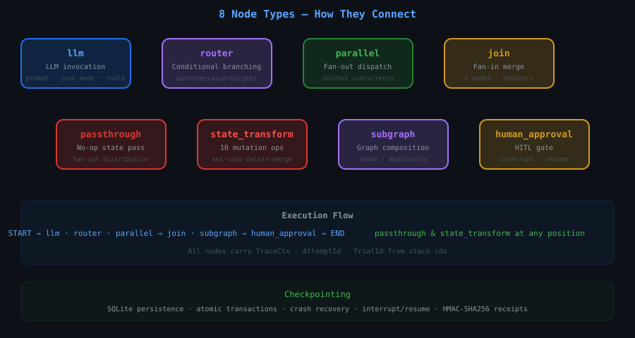

# ri-agent-graph

**Graph-based agent orchestration for Rust** — a LangGraph-inspired execution engine with 8 node types, parallel fan-out/fan-in, SQLite checkpointing, interrupt/resume, retry policies, event streaming, and HMAC-SHA256 cryptographic receipts.

[](https://crates.io/crates/ri-agent-graph)
[](https://docs.rs/ri-agent-graph)
[](LICENSE-MIT)

> **If you're building AI agents, multi-step LLM workflows, or agent councils in Rust — this is the runtime.** Define your workflow as a graph, execute it with deterministic state flowing through nodes, and get cryptographic receipts proving what happened.


## What it gives you

- **8 node types** — `llm`, `router`, `join`, `parallel`, `passthrough`, `state_transform`, `subgraph`, `human_approval` — compose any agent topology
- **Parallel fan-out/fan-in** with `JoinSet`-backed real concurrency and 5 join modes: `collect_array`, `merge_objects`, `first_non_null`, `all_success`, `quorum`
- **SQLite checkpointing** — atomic transactions, crash recovery, checkpoint mismatch detection, step-level state snapshots
- **Interrupt/resume** — pause at any node, inspect state, inject new input, resume from exact checkpoint
- **HMAC-SHA256 receipts** — `GraphExecutionReceiptV1` with step-level digests, budget counters, and trace IDs
- **Event streaming** — `StreamExt` over node lifecycle, token output, and state snapshots
- **Retry policies** — per-node configurable backoff, max retries, predicate filters
- **stack-ids integration** — `TraceCtx`, `AttemptId`, `TrialId` at every layer for distributed tracing




## Prerequisites

- **Rust** 1.75+ ([rustup.rs](https://rustup.rs))
- **SQLite** — `rusqlite` bundles SQLite via the `bundled` feature; no system library required. Disable with `default-features = false`

## Installation

```bash
cargo add ri-agent-graph
```

Or in `Cargo.toml`:

```toml
[dependencies]
ri-agent-graph = "0.2"
```

### Feature flags

| Flag | Default | Description |
|------|---------|-------------|
| `checkpointing` | ✅ on | SQLite persistence via `rusqlite` (bundled) |

```toml
# Without checkpointing
ri-agent-graph = { version = "0.2", default-features = false }
```

## Quick start

```rust
use ri_agent_graph::prelude::*;

#[tokio::main]
async fn main() -> Result<()> {
    let graph = AgentGraph::builder()
        .add_node("step1", node!(|state| async move {
            state.set("count", 1).await?;
            Ok(())
        }))
        .add_node("step2", node!(|state| async move {
            let count: i32 = state.get("count").await?;
            state.set("count", count + 1).await?;
            Ok(())
        }))
        .add_edge("step1", "step2")
        .build()?;

    let result = graph.execute("step1", AgentState::new()).await?;
    let final_count: i32 = result.get("count").await?;
    assert_eq!(final_count, 2);
    Ok(())
}
```

## Core concepts

### Graph & state model

| Type | Role |
|------|------|
| `AgentGraph<S>` | Immutable graph: nodes + edges + reducers. Built via builder, validated at `.build()` |
| `AgentState` | Thread-safe key-value state (`serde_json::Value`) flowing through execution |
| `GraphExecutor<S>` | Runtime engine. Wraps a graph and optional checkpoint store. Drives the superstep loop |

### Superstep execution loop

```
Dispatch → Execute → Checkpoint → Advance → Repeat
   │          │           │           │
   │     JoinSet for     SQLite       END sentinel
   │     fan-out nodes   atomic tx    or max_iterations
   │
 Router resolves edges
 to target frontier
```

## Node types

| Node | Purpose | Example |
|------|---------|---------|
| `llm` | Invoke an LLM via `Payload` trait. Response merged by reducer. | Text generation, classification |
| `router` | Conditional branching. Evaluates predicate → selects next edges. | Route based on LLM output |
| `parallel` | Fan-out dispatch. Concurrent branches via `JoinSet`. | Multi-agent brainstorming |
| `join` | Fan-in sync. Waits for all branches, merges with join mode. | Collect parallel results |
| `passthrough` | No-op pass. Fan-out distribution point. | Bridge coordinator → workers |
| `state_transform` | 10 ops: `set`, `copy`, `delete`, `increment`, `append`, `merge`, `merge_object`, `select`, `compare`, `format` | Format state between nodes |
| `subgraph` | Compose another graph as a node. | Reusable multi-step workflows |
| `human_approval` | HITL gate. Emits `InterruptError`, resumes via checkpoint. | Pause for operator review |

## Router example

```rust
let graph = AgentGraph::builder()
    .add_node("classify", node!(|state| async move {
        state.set("category", "bug").await?; Ok(())
    }))
    .add_node("handle_bug", node!(|state| async move {
        state.set("response", "Bug triaged").await?; Ok(())
    }))
    .add_node("handle_feature", node!(|state| async move {
        state.set("response", "Feature scoped").await?; Ok(())
    }))
    .add_edge(START, "classify")
    .add_router("classify", router!(|state| {
        let category: String = state.get("category").await?;
        Ok(match category.as_str() {
            "bug" => vec!["handle_bug"],
            "feature" => vec!["handle_feature"],
            _ => vec!["handle_bug"],
        })
    }))
    .add_edge("handle_bug", END)
    .add_edge("handle_feature", END)
    .build()?;
```

## Parallel fan-out with join

```rust
let graph = AgentGraph::builder()
    .add_node("coordinator", node!(|state| async move {
        state.set("work", json!(["A","B","C"])).await?; Ok(())
    }))
    .add_node("fanout", passthrough_node!())
    .add_node("worker_a", node!(|state| async move {
        state.set("a", "done").await?; Ok(())
    }))
    .add_node("worker_b", node!(|state| async move {
        state.set("b", "done").await?; Ok(())
    }))
    .add_node("merger", join_node!(JoinMode::CollectArray, ["a","b"], "results"))
    .add_edge("coordinator", "fanout")
    .add_edge("fanout", "worker_a")
    .add_edge("fanout", "worker_b")
    .add_edge("worker_a", "merger")
    .add_edge("worker_b", "merger")
    .add_edge("merger", END)
    .build()?;
```

## State management

```rust
state.set("name", "agent-graph").await?;
state.set("count", 42).await?;
let name: String = state.get("name").await?;
let maybe: Option<i32> = state.get_opt("missing").await?;
let keys: Vec<String> = state.keys().await;
state.remove("temp").await?;

// Snapshot & restore
let snap = state.snapshot().await;
state.restore(&snap).await?;

// State limits
let graph = AgentGraph::builder()
    .with_state_limits(StateLimits { max_keys: 100, max_value_bytes: 1_048_576 })
    .build()?;
```

## Reducers

When parallel branches write the same key, reducers resolve conflicts:

```rust
Reducers::new()
    .append_to("findings")           // Concatenate arrays
    .merge_into("metadata")          // Deep-merge objects
    .with("counter", Reducer::Add)   // Numeric addition
    .with("latest", Reducer::LastWriteWins)
    .with_fn("custom", |existing, incoming| Ok(incoming));
```

## Checkpointing & interrupt/resume

```rust
use ri_agent_graph::checkpoint_store::SqliteCheckpointStore;

let store = SqliteCheckpointStore::open("executions.db").await?;
let executor = GraphExecutor::new(graph).with_checkpoint_store(store);

match executor.execute_with_interrupt(state).await {
    Ok(receipt) => println!("Completed: {:?}", receipt.run_id),
    Err(AgentGraphError::Interrupted { checkpoint_id, .. }) => {
        executor.resume_from(checkpoint_id, injected_input).await?;
    }
}
```

## Retry policies

```rust
use ri_agent_graph::retry::RetryPolicy;

let graph = AgentGraph::builder()
    .add_node("flaky_api", node!(|state| async move { Ok(()) }))
    .with_retry_policy("flaky_api", RetryPolicy::new()
        .max_retries(3)
        .backoff(Duration::from_millis(100), Duration::from_secs(5))
        .retry_if(|err| err.to_string().contains("timeout")))
    .build()?;
```

## Event streaming

```rust
use futures::StreamExt;

let mut stream = executor.execute_stream("entry", state).await?;
while let Some(event) = stream.next().await {
    match event {
        StreamEvent::NodeStarted { node_id, attempt, .. } => {},
        StreamEvent::NodeCompleted { node_id, duration_ms, .. } => {},
        StreamEvent::TokenStream { node_id, token } => {},
        StreamEvent::StateSnapshot { state } => {},
        StreamEvent::Error { node_id, error } => {},
    }
}
```

## Execution receipts

Every run produces a `GraphExecutionReceiptV1`:

```rust
pub struct GraphExecutionReceiptV1 {
    pub run_id: String,
    pub graph_name: String,
    pub start_time: DateTime<Utc>,
    pub end_time: DateTime<Utc>,
    pub steps: Vec<StepExecutionReceiptV1>,
    pub final_state_digest: String,
    pub status: ExecutionOutcome,  // Completed | Failed | Interrupted | Cancelled
}
```

## Error handling

```rust
pub enum AgentGraphError {
    NodeNotFound(String),
    RoutingError(String),
    StateError(String),
    StateKeyNotFound(String),
    StateTypeMismatch { key: String, expected: String, actual: String },
    ParallelWriteConflict(String),
    StateLimitExceeded { key: String, limit: usize, actual: usize },
    MaxIterationsExceeded { max: usize },
    CheckpointError(CheckpointStoreOperation),
    Interrupted { checkpoint_id: String, node_id: String },
    ExecutionTimeout { run_id: String, elapsed_ms: u64 },
    Cancelled { run_id: String },
    IntegrityKeyRequired,
    Internal(String),
}
```

## Ecosystem

| Crate | Description | Version |
|-------|-------------|---------|
| [ri-agent-graph](https://crates.io/crates/ri-agent-graph) | Core engine (this crate) | v0.2.2 |
| [agent-graph-mcp](https://crates.io/crates/agent-graph-mcp) | MCP server — 25 typed tools | v0.2.4 |
| [stack-ids](https://crates.io/crates/stack-ids) | Trace/identity primitives | v0.1.3 |
| [llm-pipeline](https://crates.io/crates/llm-pipeline) | Reusable LLM node payloads | v0.2.0 |

## Comparison

| Feature | ri-agent-graph | LangGraph (Python) |
|---------|:---:|:---:|
| Language | Rust | Python |
| Type safety | ✅ Compile-time | ❌ Runtime |
| Parallel fan-out | ✅ `JoinSet` native | ✅ asyncio |
| Checkpointing | ✅ SQLite bundled | ✅ Postgres/SQLite |
| Cryptographic receipts | ✅ HMAC-SHA256 | ❌ |
| Retry policies | ✅ Per-node, predicate | ✅ Per-node |
| Event streaming | ✅ `StreamExt` | ✅ |
| MCP protocol server | ✅ Built-in | ❌ |
| Zero-copy state | ✅ `serde_json::Value` | ❌ Python dict |

## Claim boundaries

- **Graph execution semantics only** — this crate does not include LLM provider clients, prompt templating, or response parsing. Those belong in `llm-pipeline` or your application.
- **Receipts prove structural execution** — they carry digests of the local execution trace. They do not prove an external model call occurred.
- **Interrupt/resume is deterministic local** — supports linear `passthrough`/`state_transform` chains. Does not resume across LLM calls or network I/O.
- **Parallelism is best-effort** — unordered parallel writes to the same key are rejected without an explicit `Reducer`.

## Verification

```bash
cargo build --release -p ri-agent-graph
cargo test -p ri-agent-graph                          # 149 tests
cargo clippy -p ri-agent-graph -- -D warnings
cargo fmt --check
```

## Roadmap

- [ ] Typed state extractors (derive macro for `StateExtract`)
- [ ] Graph visualization (Mermaid/DOT export)
- [ ] Streaming LLM token passthrough
- [ ] Distributed checkpoint backends (PostgreSQL, S3)
- [ ] Subgraph composition with state isolation
- [ ] WebAssembly target

## Contributing

PRs welcome. See the [ri-agent-graph repo](https://github.com/RecursiveIntell/ri-agent-graph) for source and issues.

## License

MIT — see [LICENSE-MIT](LICENSE-MIT).

---

Built by [RecursiveIntell](https://github.com/RecursiveIntell) — an applied R&D studio building local-first AI infrastructure.
