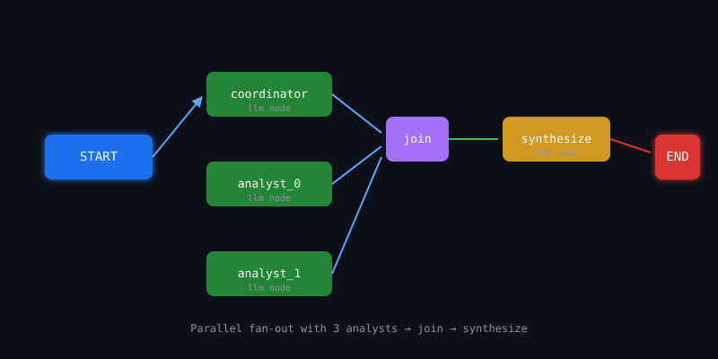
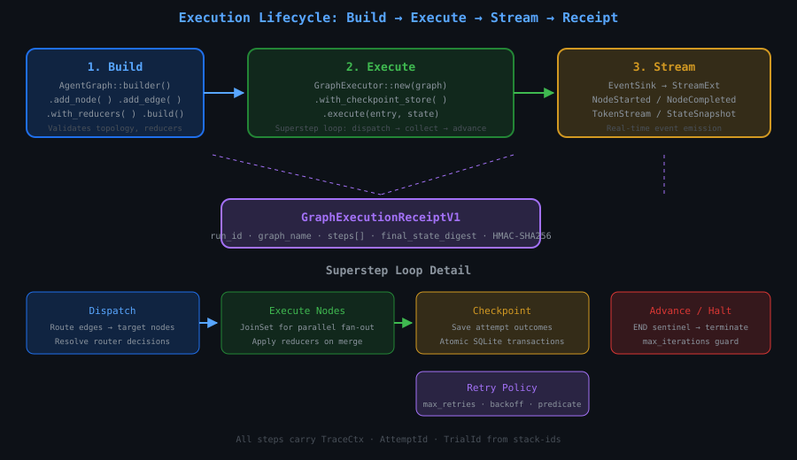
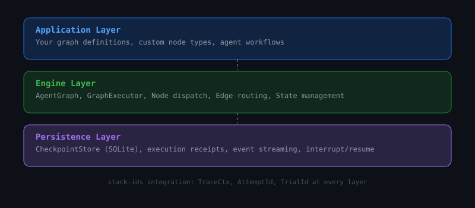

# ri-agent-graph

**Graph-based agent orchestration for Rust** — a LangGraph-inspired execution engine with checkpointing, parallel fan-out/fan-in, interrupt/resume, retry policies, and cryptographic execution receipts.

[](https://crates.io/crates/ri-agent-graph)
[](https://docs.rs/ri-agent-graph)
[](LICENSE-MIT)



## What it gives you

- **Deterministic graph execution** — define nodes as computational steps, edges as control flow, and execute with typed state flowing through the graph
- **8 node types** — `llm`, `router`, `join`, `parallel`, `passthrough`, `state_transform`, `subgraph`, `human_approval`
- **Parallel fan-out/fan-in** with configurable join policies: `collect_array`, `merge_objects`, `first_non_null`, `all_success`, `quorum`
- **Superstep execution loop** — dispatch → execute → checkpoint → advance, with automatic retry and cancellation
- **Checkpointing & interrupt/resume** — SQLite-backed persistence with atomic transactions, crash recovery, and checkpoint mismatch detection
- **Cryptographic receipts** — HMAC-SHA256 authenticated `GraphExecutionReceiptV1` with step-level digests and budget counters
- **Event streaming** — node lifecycle events, token streaming, state snapshots via `StreamExt`
- **Retry policies** — per-node retry with configurable backoff, max retries, and predicate filters
- **stack-ids integration** — `TraceCtx`, `AttemptId`, `TrialId` at every layer for distributed tracing
- **Zero-cost abstractions** — generic over user-defined state `S`, no heap allocation beyond what your nodes require





## Installation

```bash
cargo add ri-agent-graph
```

Or in `Cargo.toml`:

```toml
[dependencies]
ri-agent-graph = "0.2"
```

### Feature flags

| Flag | Default | Description |
|------|---------|-------------|
| `checkpointing` | ✅ on | SQLite-backed persistence via `rusqlite` |

To run without persistence:

```toml
ri-agent-graph = { version = "0.2", default-features = false }
```

## Quick start

```rust
use ri_agent_graph::prelude::*;

#[tokio::main]
async fn main() -> Result<()> {
    let graph = AgentGraph::builder()
        .add_node("step1", node!(|state| async move {
            state.set("count", 1).await?;
            Ok(())
        }))
        .add_node("step2", node!(|state| async move {
            let count: i32 = state.get("count").await?;
            state.set("count", count + 1).await?;
            Ok(())
        }))
        .add_edge("step1", "step2")
        .build()?;

    let state = AgentState::new();
    let result = graph.execute("step1", state).await?;

    let final_count: i32 = result.get("count").await?;
    assert_eq!(final_count, 2);
    Ok(())
}
```

## Core concepts

### Graph & state model

The public API centers on three types:

- **`AgentGraph<S>`** — immutable graph definition: nodes + edges + reducers. Built with the builder pattern and validated at `.build()`.
- **`AgentState`** — key-value state (`serde_json::Value`) flowing through execution. Thread-safe via `Arc<RwLock<>>`.
- **`GraphExecutor<S>`** — the runtime engine. Wraps a graph and optional checkpoint store. Drives the superstep loop.

State is typed but flows as `serde_json::Value` internally, enabling heterogeneous workflows where different nodes operate on different state keys.

### Superstep execution loop

```
1. Dispatch  →  Route edges from current frontier to target nodes
2. Execute   →  Run all target nodes (parallel via JoinSet for fan-out)
3. Checkpoint →  Save attempt outcomes to SQLite (if enabled)
4. Advance   →  Set new frontier; halt if END sentinel reached
5. Repeat    →  Guarded by max_iterations; retry on failure with policy
```

### State management

```rust
// Set/get typed values
state.set("name", "agent-graph").await?;
state.set("count", 42).await?;
let name: String = state.get("name").await?;
let count: i32 = state.get("count").await?;

// Optional access
let maybe: Option<String> = state.get_opt("missing").await?;

// Check existence
if state.contains("name").await? {
    // ...
}

// List all keys
let keys: Vec<String> = state.keys().await;

// Remove a key
state.remove("temp").await?;

// Snapshot & restore
let snapshot = state.snapshot().await;
state.restore(&snapshot).await?;
```

### State limits

```rust
let graph = AgentGraph::builder()
    .with_state_limits(StateLimits {
        max_keys: 100,
        max_value_bytes: 1024 * 1024, // 1MB
    })
    .build()?;
```

## Node types

| Type | Description | Status |
|------|-------------|--------|
| `llm` | Invoke an LLM via `Payload` trait. Response merged via reducer. | ✅ |
| `router` | Conditional branching. Evaluates a predicate to select next edges dynamically. | ✅ |
| `join` | Fan-in synchronization. Waits for all parallel branches, merges state. | ✅ |
| `parallel` | Fan-out dispatch. Engine's `JoinSet` handles real concurrent execution. | ✅ |
| `passthrough` | No-op pass. Useful for fan-out distribution points between coordinator and workers. | ✅ |
| `state_transform` | 10 declarative state mutations: `set`, `copy`, `delete`, `increment`, `append`, `merge`, `merge_object`, `select`, `compare`, `format`. | ✅ |
| `subgraph` | Reference another registered graph as a composable sub-workflow. | ✅ |
| `human_approval` | HITL gate. Emits `InterruptError`; resumes via checkpoint injection. | ✅ |

## Router example

```rust
use ri_agent_graph::{AgentGraph, node, START, END};
use serde_json::json;

let graph = AgentGraph::builder()
    .add_node("classify", node!(|state| async move {
        state.set("category", "bug").await?;
        Ok(())
    }))
    .add_node("handle_bug", node!(|state| async move {
        state.set("response", "Bug triaged").await?;
        Ok(())
    }))
    .add_node("handle_feature", node!(|state| async move {
        state.set("response", "Feature scoped").await?;
        Ok(())
    }))
    .add_node("handle_question", node!(|state| async move {
        state.set("response", "Question answered").await?;
        Ok(())
    }))
    .add_edge(START, "classify")
    .add_router("classify", router!(|state| {
        let category: String = state.get("category").await?;
        Ok(match category.as_str() {
            "bug" => vec!["handle_bug"],
            "feature" => vec!["handle_feature"],
            _ => vec!["handle_question"],
        })
    }))
    .add_edge("handle_bug", END)
    .add_edge("handle_feature", END)
    .add_edge("handle_question", END)
    .build()?;
```

## Parallel fan-out with join

```rust
let graph = AgentGraph::builder()
    .add_node("coordinator", node!(|state| async move {
        state.set("workstreams", json!(["A", "B", "C"])).await?;
        Ok(())
    }))
    .add_node("fanout", passthrough_node!())
    .add_node("worker_a", node!(|state| async move {
        state.set("result_a", "done").await?;
        Ok(())
    }))
    .add_node("worker_b", node!(|state| async move {
        state.set("result_b", "done").await?;
        Ok(())
    }))
    .add_node("worker_c", node!(|state| async move {
        state.set("result_c", "done").await?;
        Ok(())
    }))
    .add_node("merger", join_node!(JoinMode::CollectArray,
        ["result_a", "result_b", "result_c"], "findings"))
    .add_edge("coordinator", "fanout")
    .add_edge("fanout", "worker_a")
    .add_edge("fanout", "worker_b")
    .add_edge("fanout", "worker_c")
    .add_edge("worker_a", "merger")
    .add_edge("worker_b", "merger")
    .add_edge("worker_c", "merger")
    .add_edge("merger", END)
    .with_reducers(Reducers::new().append_to("findings"))
    .build()?;
```

## Reducers

When parallel branches write to the same state key, a reducer resolves the conflict:

```rust
use ri_agent_graph::reducer::Reducer;

Reducers::new()
    .append_to("findings")          // Concatenate arrays
    .merge_into("metadata")          // Deep-merge objects
    .with("counter", Reducer::Add)   // Numeric addition
    .with("latest", Reducer::LastWriteWins)
    .with_fn("custom", |existing, incoming| {
        // Your merge logic here
        Ok(incoming)
    });
```

## Checkpointing & interrupt/resume

```rust
use ri_agent_graph::checkpoint_store::SqliteCheckpointStore;

let store = SqliteCheckpointStore::open("executions.db").await?;
let executor = GraphExecutor::new(graph)
    .with_checkpoint_store(store);

match executor.execute_with_interrupt(state).await {
    Ok(receipt) => println!("Completed: {:?}", receipt.run_id),
    Err(AgentGraphError::Interrupted { checkpoint_id, .. }) => {
        // Inject new input and resume from exact checkpoint
        executor.resume_from(checkpoint_id, injected_input).await?;
    }
}
```

### Retry on failure

```rust
use ri_agent_graph::retry::RetryPolicy;

let graph = AgentGraph::builder()
    .add_node("flaky_api", node!(|state| async move {
        // ...
        Ok(())
    }))
    .with_retry_policy("flaky_api", RetryPolicy::new()
        .max_retries(3)
        .backoff(Duration::from_millis(100), Duration::from_secs(5))
        .retry_if(|err| err.to_string().contains("timeout")))
    .build()?;
```

## Execution receipts

Every run produces a `GraphExecutionReceiptV1`:

```rust
pub struct GraphExecutionReceiptV1 {
    pub run_id: String,
    pub graph_name: String,
    pub start_time: DateTime<Utc>,
    pub end_time: DateTime<Utc>,
    pub steps: Vec<StepExecutionReceiptV1>,
    pub final_state_digest: String,
    pub status: ExecutionOutcome,  // Completed | Failed | Interrupted | Cancelled
}
```

Each `StepExecutionReceiptV1`:
- `node_id` — which node executed
- `attempt` — attempt number (0-based)
- `duration_ms` — wall-clock duration
- `input_digest` / `output_digest` — state hashes before/after
- `error` — error details if the node failed
- `trace_ctx` / `attempt_id` / `trial_id` — from `stack-ids`

## Error handling

```rust
pub enum AgentGraphError {
    // Build errors
    GraphBuild(String),
    NodeNotFound(String),
    EdgeNotFound(String),
    DuplicateNode(String),

    // Runtime errors
    StateKeyNotFound(String),
    StateTypeMismatch { key: String, expected: String, actual: String },
    ParallelWriteConflict(String),

    // Limits
    StateLimitExceeded { key: String, limit: usize, actual: usize },
    MaxIterationsExceeded { max: usize },

    // Checkpoint
    CheckpointError(CheckpointStoreOperation),
    CheckpointMismatch { expected: String, actual: String },

    // Lifecycle
    Interrupted { checkpoint_id: String, node_id: String },
    ExecutionTimeout { run_id: String, elapsed_ms: u64 },
    Cancelled { run_id: String },

    // Other
    IntegrityKeyRequired,
    Internal(String),
}
```

All fallible operations return `Result<T, AgentGraphError>`.

## Event streaming

```rust
use futures::StreamExt;

let executor = GraphExecutor::new(graph);
let mut stream = executor.execute_stream("entry", state).await?;

while let Some(event) = stream.next().await {
    match event {
        StreamEvent::NodeStarted { node_id, attempt, .. } => {},
        StreamEvent::NodeCompleted { node_id, duration_ms, .. } => {},
        StreamEvent::TokenStream { node_id, token } => {},
        StreamEvent::StateSnapshot { state } => {},
        StreamEvent::Error { node_id, error } => {},
    }
}
```

## Ecosystem

| Crate | Description | Version |
|-------|-------------|---------|
| [ri-agent-graph](https://crates.io/crates/ri-agent-graph) | Core graph execution engine (this crate) | v0.2.1 |
| [agent-graph-mcp](https://crates.io/crates/agent-graph-mcp) | MCP server — 25 typed tools for graph lifecycle, execution, approval, templates | v0.2.2 |
| [stack-ids](https://crates.io/crates/stack-ids) | Shared identity, scope, and trace primitives | v0.1.3 |
| [llm-pipeline](https://crates.io/crates/llm-pipeline) | Reusable LLM node payloads (Ollama, prompt templating, parsing) | v0.2.0 |

## Comparison

| Feature | ri-agent-graph | LangGraph (Python) | LangGraph (JS) |
|---------|:---:|:---:|:---:|
| Language | Rust | Python | TypeScript |
| Parallel fan-out | ✅ JoinSet | ✅ | ✅ |
| Checkpointing | ✅ SQLite | ✅ Postgres/SQLite | ✅ Postgres/SQLite |
| Interrupt/resume | ✅ Deterministic | ✅ Full | ✅ Full |
| Retry policies | ✅ Per-node | ✅ Per-node | ✅ Per-node |
| Event streaming | ✅ StreamExt | ✅ | ✅ |
| Cryptographic receipts | ✅ HMAC-SHA256 | ❌ | ❌ |
| MCP protocol server | ✅ Built-in | ❌ | ❌ |
| Zero-copy state | ✅ serde_json::Value | ❌ Python dict | ❌ JS object |

## Claim boundaries

- **Graph execution semantics only** — this crate does not include LLM provider clients, prompt templating, or response parsing. Those belong in `llm-pipeline` or your application layer.
- **Receipts prove structural execution** — they carry cryptographic digests of the local execution trace only. They do not prove that an external LLM call occurred or what any provider's internal state was.
- **Interrupt/resume is deterministic local** — supports linear chains of deterministic `passthrough` and `state_transform` nodes with SQLite-bound state. It does not support resuming across LLM calls, network I/O, or external tool invocations.
- **Parallelism is best-effort** — uses Tokio's `JoinSet`. Unordered parallel writes to the same state key are rejected unless an explicit `Reducer` is declared.

## Verification

```bash
cargo build --release -p ri-agent-graph
cargo test -p ri-agent-graph          # 149 tests
cargo clippy -p ri-agent-graph -- -D warnings
cargo fmt --check
cargo publish -p ri-agent-graph --dry-run
```

## Roadmap

- [ ] Typed state extractors (derive macro for `StateExtract`)
- [ ] Graph visualization (Mermaid/DOT export from `graph_inspect`)
- [ ] Streaming LLM token passthrough to event stream
- [ ] Distributed checkpoint backends (PostgreSQL, S3)
- [ ] Subgraph composition with isolated state namespaces
- [ ] WebAssembly target (`wasm-bindgen`, no_std without checkpointing)
- [ ] Generic replay for non-deterministic node types

## License

MIT — see [LICENSE-MIT](LICENSE-MIT).

---

Built by [RecursiveIntell](https://github.com/RecursiveIntell) — an applied R&D studio building local-first AI infrastructure.
