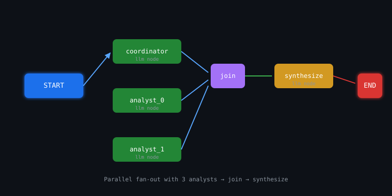

# ri-agent-graph

A LangGraph-inspired Rust runtime for explicit graph execution, shared state, routing, parallel branches, retries, interrupts, and checkpoint integration.

The engine coordinates caller-supplied nodes and payloads. The separate MCP adapter defines declarative `llm`, `router`, `join`, and other JSON node types, provider configuration, operator approval storage, and authenticated MCP receipts. Those adapter capabilities are not all built into the engine crate.




## Quick start

For a Rust application using the published engine:

```toml
[dependencies]
ri-agent-graph = "0.2"
tokio = { version = "1", features = ["macros", "rt-multi-thread"] }
```

```rust
use ri_agent_graph::prelude::*;

#[tokio::main]
async fn main() -> Result<()> {
    let graph = AgentGraph::builder()
        .add_node("first", node!(|state| async move {
            state.set("count", 1).await?;
            Ok(())
        }))
        .add_node("second", node!(|state| async move {
            let count: i32 = state.get("count").await?;
            state.set("count", count + 1).await?;
            Ok(())
        }))
        .add_edge("first", "second")
        .build()?;

    let state = graph.execute("first", AgentState::new()).await?;
    assert_eq!(state.get::<i32>("count").await?, 2);
    Ok(())
}
```

This example needs no model server. An LLM-backed node needs the provider configuration and implementation supplied by its caller.

## Engine API

| Surface | Current role |
|---|---|
| `AgentGraph` / `AgentGraphBuilder` | Define nodes, edges, routers, reducers, execution limits, event sinks, and checkpoint hooks |
| `AgentState` | Async JSON-valued state with typed reads/writes, limits, snapshots, transactions, and forks |
| `Node`, `FnNode`, `node!` | Caller-defined executable nodes |
| `RoutingFunction`, `RouterOutput` | Explicit conditional routing |
| `Payload`, `PayloadNode` | Adapt reusable work into a node |
| `RetryPolicy` | Attempt bounds, backoff, jitter, and retry predicates |
| `CheckpointStore` / `CheckpointSaver` | Checkpoint integration contracts |
| `GraphEvent`, `EventSink`, `StreamEvent` | Observable execution events |

`AgentGraph` is not generic over a state type. `GraphExecutor` is an internal execution detail, not a public constructor. Use the methods on `AgentGraph`, such as `execute`, `execute_with_config`, and `execute_with_summary`.

## State and retries

```rust
use ri_agent_graph::prelude::*;
use ri_agent_graph::retry::RetryPolicy;
use std::time::Duration;

async fn state_example() -> Result<()> {
    let state = AgentState::new();
    state.set("count", 1).await?;
    let snapshot = state.snapshot().await;
    let removed = state.remove("count").await;
    assert!(removed.is_some());
    state.restore(&snapshot).await;
    Ok(())
}

fn retry_policy() -> RetryPolicy {
    RetryPolicy::new()
        .with_max_attempts(3)
        .with_initial_interval(Duration::from_millis(100))
        .with_max_interval(Duration::from_secs(5))
}
```

Attach a retry policy with `AgentGraphBuilder::add_node_with_retry`. `max_attempts` includes the initial attempt. Retries repeat caller-defined work, so side-effecting nodes need an appropriate idempotency policy.

## Checkpoints, interrupts, and streams

Choose a checkpointer or checkpoint store explicitly through the builder. Interrupt/resume APIs and checkpoint metadata are defined by [graph.rs](src/graph.rs), [checkpoint_store.rs](src/checkpoint_store.rs), and [interrupt.rs](src/interrupt.rs). The default `checkpointing` feature enables the SQLite dependency; it does not automatically configure a database for every graph.

`StreamEvent` includes `GraphStart`, `GraphEnd`, `NodeStart`, `NodeEnd`, `StateUpdate`, `SuperstepStart`, `SuperstepEnd`, `Interrupt`, and `Custom`. It is non-exhaustive. Use the checked-in streaming example rather than assuming provider-token events exist on this engine enum.

## Receipts and trust

[receipt.rs](src/receipt.rs) defines `GraphExecutionReceiptV1` with `graph_id`, `execution_id`, timestamps, steps, and outcome. The type contains caller-populated digest fields; this engine crate does not implement HMAC signing. An execution result or digest alone is not independent proof that a model's answer is true. Authenticated receipts and operator authority in `agent-graph-mcp` belong to that separate adapter.

## Examples and validation

The [examples directory](examples/) covers basic graphs, conditional routing, loops, parallel execution, map/reduce, reducers, checkpoints, human-in-the-loop behavior, retries, streaming, and subgraphs. Inspect each example's model or feature requirements before running it.

From the `ri-agent-graph` workspace root:

```bash
cargo run -p ri-agent-graph --example basic
cargo test -p ri-agent-graph
cargo clippy -p ri-agent-graph --all-targets -- -D warnings
```

A source or test count is not a stable API contract; use the test output for the exact revision and enabled features.

## License

The package declares MIT. See [the workspace license](../LICENSE-MIT).

### Checkpoint storage features

The `Checkpoint` data record, in-memory checkpoint APIs and ordinary graph/
interrupt execution are available with `default-features = false`. The default
`checkpointing` feature enables the optional SQLite dependency,
`CheckpointManager` and `SqliteSaver`. Enabling the feature makes those APIs
available; it does not attach or activate a store automatically. In-memory data
support is not durable recovery or authority. Existing serialized checkpoint
fields and SQLite behavior are unchanged.
